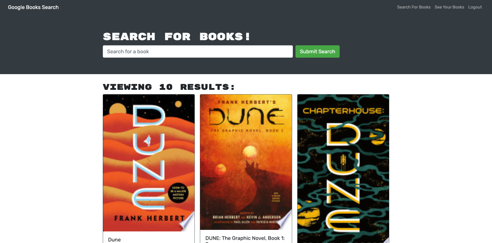
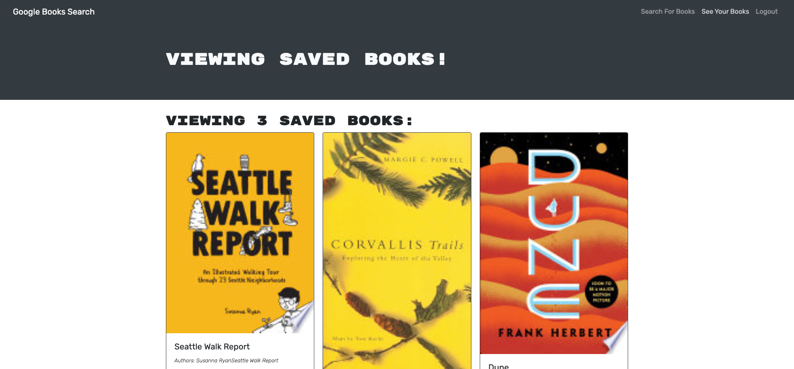

# Book-Nook 
A Google Books search engine, built with a RESTful API and refactored with Apollo Server and GraphQL.

## Table of Contents
1. [Installation](#installation)
2. [Usage](#usage)
3. [License](#license)
4. [Questions](#questions)

## Installation
In browser, navigate to https://sn-book-nook.herokuapp.com/

## Usage
After creating an account or logging in, users can search for books and save them to their collection. After saving, the corresponding button will indicate that the book was saved, and will no longer be clickable. Users can view their saved books, as well as delete them.
 https://sn-book-nook.herokuapp.com/saved 

## License
This project is [MIT](https://opensource.org/licenses/MIT) licensed.

## Questions
Additional questions? Please contact me at sammn721@gmail.com.
For more projects, please visit my [GitHub profile](https://github.com/sammn721).
